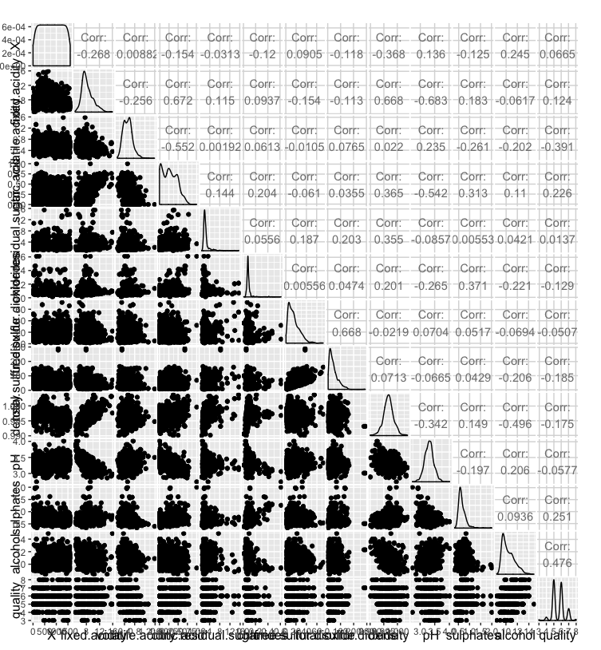
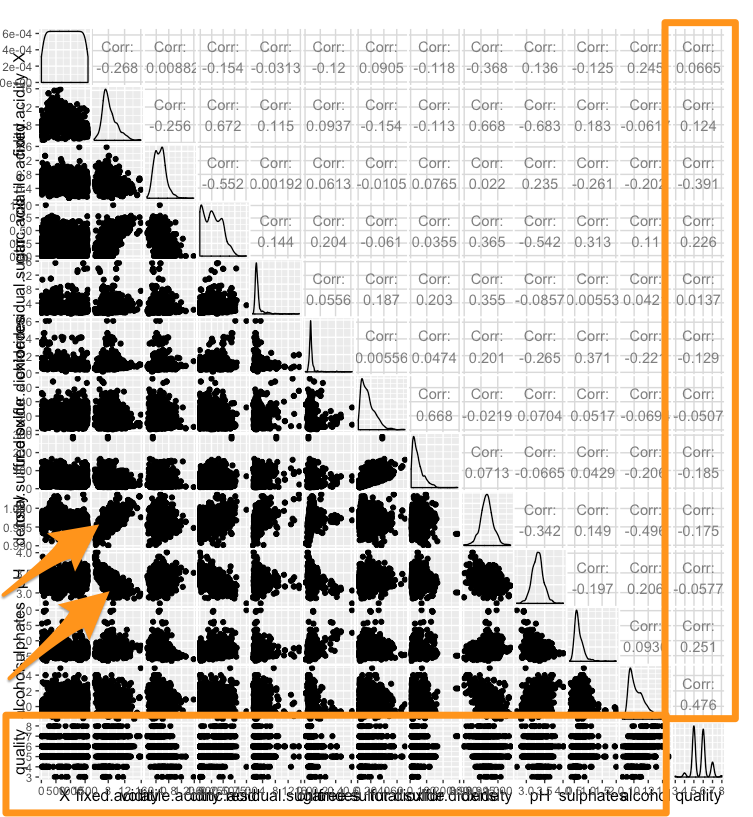

```{r setup, include=FALSE}
knitr::opts_chunk$set(echo = TRUE)

```

## Setup

Make the working directory the folder for this project:

```{r, echo=FALSE}
getwd()
setwd('/Users/Morgan/Github/udacity-data-analyst-nanodegree/p4')
```

```{r} 
# setwd('<path to folder>/p4')
# install.packages("ggplot2")
# install.packages("knitr", dependencies = T)
# install.packages("dplyr", dependencies = T)
# install.packages("GGally", dependencies = T)
# library(ggplot2)
# library
```

```{r, echo=FALSE}
library(ggplot2)
library(GGally)
library(grid)
library(gridExtra)
```

Load the data:

```{r}
df <- read.csv('wineQualityReds.csv')
```

## About the data

This tidy data set contains 1,599 red wines with 11 variables on the chemical properties of the wine. At least 3 wine experts rated the quality of each wine, providing a rating between 0 (very bad) and 10 (very excellent).

## Guiding question

- Which chemical properties influence the quality of red wines?

## Initial observations

First we'll check out the structure and schema of the data set:

```{r}
str(df)
summary(df)
```


*Note* X is just the id or row number.

It's interesting to noe the min and max values for some of the chemical properties. Density is between .9901 and 1.0037, while total sulfur dioxide ranges from 6 to 289.

We are primarily interested in wine quality, which ranges from 3 - 8. The median is 6 and the average quality rating is 5.636.


## GGPairs

Let's get a quick look at all variable pairs

```{r }
# ggpairs(df)
```




The correlations between all variables and quality are worth noting. The variable with the highest positive correlation is alcohol, followed by sulphates. The variable with the greatest negative correlation is volatile acidity (-0.391).


## Initial observations

Let's also look at the bottom row, a plot of each variable against quality. I noted the distributions for total sulfur dioxide against quality. For low amounts of sulfur dioxide, quality is either high or low. While for higher levels of sulfur dioxide, quality is more consistently around averge (5-6). I'll have to look into that relationship (it isn't linear). I think I can see a slightly *linear* relationship between alcohol and quality, density and quality, and volatile acidity and quality.


## Plots

Let's do some plots!

### Distribution of Quality

It appears to be a normal distribution of quality.

```{r }

ggplot(data = df,
       aes(x = quality, binwidth = 1)) +
  geom_histogram()

```


### Quality by Alcohol

Now, let's look at the variables I thought might have a linear relationship with quality.

``` {r Quality by Alcohol}
ggplot(data = df,
       aes(x = alcohol, y = quality)) +
  geom_point() + 
  scale_x_continuous() + 
  scale_y_continuous() +
  ggtitle('Quality by Alcohol')
```

Looks like overplotting. So let's add some jitter and transparency to the points:

``` {r Quality by Alcohol with Jitter and Transparency}
ggplot(data = df,
       aes(x = alcohol, y = quality)) +
  geom_point(position = 'jitter', alpha = 0.5, size = 0.75) + 
  scale_x_continuous() + 
  scale_y_continuous() +
  ggtitle('Quality by Alcohol with Jitter and Transparency')
```


### Quality by Density

From looking at the plot below, I'm not so sure about the linear relationship

``` {r Quality by Density with Jitter and Transparency}

ggplot(data = df,
       aes(x = density, y = quality)) +
  geom_point(position = 'jitter', alpha = 0.5, size = 0.75) + 
  scale_x_continuous() + 
  scale_y_continuous() +
  ggtitle('Quality by Density with Jitter')
```

### Quality by Volatile Acidity

There might still be a linear relationship here

``` {r Quality by Volatile Acidity with Jitter and Transparency}
ggplot(data = df,
       aes(x = volatile.acidity, y = quality)) +
  geom_point(position = 'jitter', alpha = 0.5, size = 0.75) + 
  scale_x_continuous() + 
  scale_y_continuous() +
  ggtitle('Quality by Volatile Acidity with Jitter and Transparency')
```


### Quality by Sulphates

There might still be a linear relationship here

``` {r Quality by Sulphates with Jitter and Transparency}
ggplot(data = df,
       aes(x = sulphates, y = quality)) +
  geom_point(position = 'jitter', alpha = 0.5, size = 0.75) + 
  scale_x_continuous() + 
  scale_y_continuous() +
  ggtitle('Quality by Sulphates with Jitter and Transparency')
```


### Quality by Acidic Attributes

``` {r}
grid.arrange(ggplot(data = df, aes(x = quality, y = fixed.acidity)) + 
               ylab('Fixed Acidity') +
               xlab('Quality') +
               geom_point(),
             ggplot(data = df, aes(x = quality, y = volatile.acidity)) +
               ylab('Volatile Acidity') +
               xlab('Quality') +
               geom_point(), 
             ggplot(data = df, aes(x = quality, y = citric.acid)) +
               ylab('Citric Acid') +
               xlab('Quality') +
               geom_point(), 
             ggplot(data = df, aes(x = quality, y = pH)) +
               ylab('pH') +
               xlab('Quality') +
               geom_point())

```


## Problems

I wanted to create a stacked plot of some acidic qualities with quality being the fill. I got this error:
```{r}
# ggplot(df, aes(x = citric.acid, y = fixed.acidity, colour = quality, fill = quality)) + geom_area(position = 'stack')
# Error in f(...) : Aesthetics can not vary with a ribbon
```

So, I created a new variable "rating":

``` {r}
df$rating <- ifelse(df$quality < 5, 'bad', ifelse(
  df$quality < 7, 'average', 'good'))
df$rating <- ordered(df$rating,
                     levels = c('bad', 'average', 'good'))
summary(df$rating)
```

While, that did get the stacked plot to work, the plot itself wasn't of much use:

``` {r}
ggplot(df, aes(x = citric.acid, y = rating)) + geom_area(position = 'stack')
```


### Bivariate Analysis


```{r}
ggplot(data = df,
       aes(y = density, x = alcohol,
           color = rating)) +
  geom_point() +
  scale_color_brewer()


```

It seems that as alcohol content increases, density decreases. Perhaps alcohol, by nature is more dense than the ingredients of wine? This last plot also indicates that, holding alcohol constant, density does not affect quality.


``` {r}

ggplot(data = df,
       aes(y = sulphates, x = floor(alcohol),
           color = quality)) +
  geom_point() +
  scale_y_continuous(limits=c(0.3,1.5)) +
  scale_fill_gradient(low="green",high="darkgreen")

```

This makes me think that if you hold alcohol constant, then more sulphates improves the quality of the wine.


## Model


```{r, echo=FALSE}

# ?lm
library(memisc)

```

``` {r}


m1 <- lm(quality ~ alcohol, data = df)
m2 <- update(m1, ~ . + sulphates)
m3 <- update(m2, ~ . + citric.acid)
m4 <- update(m3, ~ . + volatile.acidity)
m5 <- update(m4, ~ . + fixed.acidity)
mtable(m1, m2, m3, m4, m5)


```

The R squared value of m5 is 0.3. Which means that our regression model only explains around 30% of the variance in quality. It seems we are missing the information that would better predict the quality of wine.

```{r, echo=FALSE}

# ?lm
# install.packages("memisc")
library(dplyr)

```

``` {r}

set.seed(87654321)
training_data <- sample_frac(df, .6)
test_data <- df[ !df$X %in% training_data$X, ]

results <- data.frame(
  test_data$quality,
  predict(m5, test_data) - as.numeric(test_data$quality)
)
names(results) <- c("quality", "error")
ggplot(data=results, aes(x=quality,y=error)) +
  geom_point()
```

The residual plot indicates wide swings in error.


## Final Plot

``` {r}
ggplot(data = df,
       aes(y = sulphates, x = alcohol,
           color = rating)) +
  geom_point() +
  scale_y_continuous(limits=c(0.3,1.5)) +
  ylab("potassium sulphate (g/dm3)") +
  xlab("alcohol (% by volume)") +
  scale_color_brewer() +
  ggtitle("Alcohol and sulphates over wine quality")

```


## Reflection

Judging by the regression model, there must be some key information missing that might better predict quality.

From looking at the initial ggpairs plot, it did seem that there was some correlation between quality and a couple variables provided by the data set, namely: alcohol, sulphates, citric.acid, fixed.acidity, and volatile.acidity. Density may have been another variable we could have used in our model.

From looking at the distributions of chemical variables, many had ver long tails and skewed distributions. Only a couple had normal distributions (density, pH).

For many variables, a scatterplot against quality did not indicate much. Even after adding jitter to account for overplotting.

For future studies, it would be helpful to have any additional ingredients. Also, if it were possible to segment the wines, we could hold constant certain qualities - I'm no wine expert, but I believe cabernets probably have different chemicals than merlots, etc.

Another consideration: we cannot account for taste. We do not know who the tasters are. Certainly, different people taste things differently, and that may account for varying quality ratings.

What I did learn is that wines with high alcohol and sulphates do tend to be rated higher. So, those are ingredients I will look for when making my next wine purchase.


